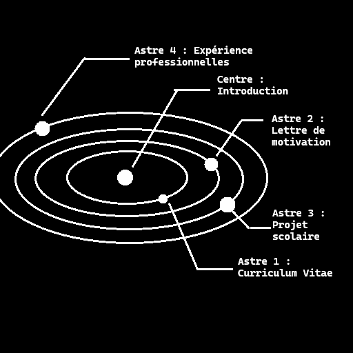

# Portfolio Website - Chauvel Sacha
[lien repository github](https://github.com/Afissard/Portfolio-Website)
## run instruction
```bash
bun run dev
```
[page web](http://localhost:5173/)
# Cahier des charges : originalité
- quelque chose de visuellement impressionnant et original comme de la 3D (assez minimaliste) ->  Javascript/Typescript + un framework (three js) …
- Shaders ?
- Interactivité avec l'utilisateur, mini jeu / gimmick.
# Concept
Le site est un "système solaire", en scrollant la caméra se déplace du centre vers le périphérique extérieur, chaque planètes et astres croisé représente une des section demandée. Chaque astre pourrais avoir son thème, un peu dans le genre des différente planètes du Petit Prince, ou celles du monde d'Albator et Queen Esmeraldas, imaginé par Leiji Matsumoto. Un astre peut aussi être un vaisseau spatial ou un objet représentatif du sujet, tout est bon tant que le thème de l'espace / science fiction / cyberpunk est conservé.



Cette image reste un concept, puis que le rail de la camera suivra un axe prédéfini (peut être une légère courbe), les astres ayant du contenu seront donc tous plus ou moins aligné, ceux en arrière plan n'on qu'un but décoratif.
Feature à coder : un léger coup de scroll permet de se déplacer d'une section à l'autre -> moins de fatigue pour parcourir le site
# Structure et contenu
## 1 Introduction
> Brève présentation de qui nous somme, objectif académique et professionnels.

Petite phrase / citation qui me défini puis brève présentation. A droite en décors un autoportrait (3D low poly)
## 2 Curriculum Vitae
> Un CV à jour détaillant la formation, les expérience de travail, les compétences, les certification et d'autre réalisation pertinentes.

Une image de mon CV (à corriger pour correspondre à un CV général et non job d'été), cliqué elle ouvre une page de téléchargement/visualisation du CV en PDF.
## 3 Lettre de motivation
> La lettre de motivation est un document d'une page maximum, adressé à un recruteur pour lui faire part de votre volonté de travailler avec lui tout lui faisant valoir vos qualités pour le poste. Il existe deux type de lettres de motivation : la candidature spontanée et la lettre qui répond à une annonce.

Lettre de motivation à écrire, présentation dans le même style que le CV (image avec redirection)
## 4 Projet scolaire
> Il s'agit de parler de son parcours scolaire et de la poursuite de ce dernier. Il faut mettre en évidence tous les projets que vous avez mis en œuvre dans le cadre de vos études.

Une frise chronologique (horizontal), donnée les périodes et les projet scolaire réalisé.
Chaque période pourrais être un petit astre gravitant autour de l'astre principal. Pour voir le suivant, il faudrait pouvoir cliquer un bouton et faire défilé les astres. 
## 5 Mes expériences professionnelles
> Un aperçu des stages, emplois à temps partiel, volontariats et autre expériences professionnelles, incluant les responsabilité assumées et mes compétences développées.

Même présentation que le parcours scolaire
## 6 Mes projet personnels
> Il faut parler de vos passion, de vos activités favorites et des actions personnelles éventuelles que vous avez pus mener.
> Autres réalisations personnelles (exemple développent d'un jeu)

Même présentation que précédant (sans la partie chronologique ?)