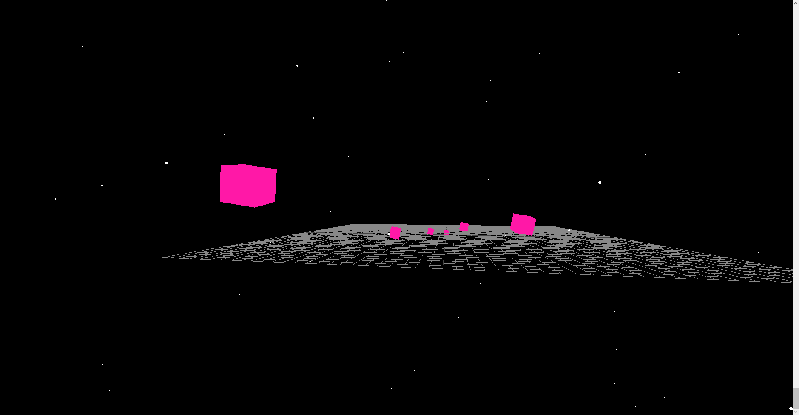

# Portfolio Website - Chauvel Sacha
[lien vers le dépôt GitHub](https://github.com/Afissard/Portfolio-Website)



## Exécution du projet
nécessite [Bun](https://bun.sh/)

Installation des dépendances
```bash
bun install
```

Lancement du serveur en local
```bash
bun run dev
```

[lien vers la page web en local](http://localhost:5173/)

# Idée du design du site
Le site est un "système solaire", en scrollant la caméra se déplace du centre vers le périphérique extérieur, chaque planète et astre croisé représente une des sections demandées. Chaque astre pourrait avoir son thème, un peu dans le genre des différentes planètes du Petit Prince, ou celles du monde d'Albator et de Queen Esmeraldas, imaginées par Leiji Matsumoto. Un astre peut aussi être un vaisseau spatial ou un objet représentatif du sujet, tout est bon tant que le thème de l'espace / science-fiction / cyberpunk est conservé.


Cette image reste un concept, puisque le rail de la caméra suivra un axe prédéfini (peut-être une légère courbe), les astres ayant du contenu seront donc tous plus ou moins alignés, ceux en arrière-plan n'ont qu'un but décoratif.
Fonctionnalité à coder : un léger coup de scroll permet de se déplacer d'une section à l'autre -> moins de fatigue pour parcourir le site.

# Structure et contenu
## 1 Introduction
> Brève présentation de qui nous sommes, objectif académique et professionnel.

### site
Petite phrase / citation qui me définit puis brève présentation. À droite en décor, un autoportrait (3D low poly).
Modèle 3D : mon avatar chevauchant une fusée d'artifice
### rédaction
**citation :** “Il faut toujours viser la lune, car même en cas d'échec, on atterrit dans les étoiles.” (Oscar Wilde)

**brève présentation :** Sacha Chauvel. Je suis étudiant en BUT informatique et j'aimerais travailler dans l'industrie du jeu vidéo.

## 2 Curriculum Vitae
> Un CV à jour détaillant la formation, les expériences de travail, les compétences, les certifications et d'autres réalisations pertinentes.

### site
Une image de mon CV (à corriger pour correspondre à un CV général et non à un job d'été), cliquée elle ouvre une page de téléchargement/visualisation du CV en PDF.
Modèle 3D : avatar en holograme position "wanted"
### CV en PDF
[mon CV](./website-content/CV%20Sacha%20Chauvel%20-%20Stage.pdf)

## 3 Lettre de motivation
> La lettre de motivation est un document d'une page maximum, adressé à un recruteur pour lui faire part de votre volonté de travailler avec lui tout en lui faisant valoir vos qualités pour le poste. Il existe deux types de lettres de motivation : la candidature spontanée et la lettre qui répond à une annonce.

### site
Lettre de motivation à écrire, présentation dans le même style que le CV (image avec redirection).
Modèle 3D : TODO
### lettre de motivation en PDF
(Recrutement Ankama)[https://recrutement.ankama.com/]
[ma lettre de motivation](./website-content/Sacha%20Chauvel%20Lettre%20de%20motivation%20stage%20BUT2.pdf)

## 4 Projet scolaire
> Il s'agit de parler de son parcours scolaire et de la poursuite de ce dernier. Il faut mettre en évidence tous les projets que vous avez mis en œuvre dans le cadre de vos études.

### site
Une frise chronologique (horizontale), donnant les périodes et les projets scolaires réalisés.
Chaque période pourrait être un petit astre gravitant autour de l'astre principal. Pour voir le suivant, il faudrait pouvoir cliquer sur un bouton et faire défiler les astres.
Modèle 3D : avatar parmis des piles de livres
### rédaction
TODO.

## 5 Mes expériences professionnelles
> Un aperçu des stages, emplois à temps partiel, volontariats et autres expériences professionnelles, incluant les responsabilités assumées et mes compétences développées.

### site
Même présentation que le parcours scolaire.
Modèle 3D : avatar face à un ordinateur retro (ecrant cathodique, exemple Macintosh)
### rédaction
TODO.

## 6 Mes projets personnels
> Il faut parler de vos passions, de vos activités favorites et des actions personnelles éventuelles que vous avez pu mener.
> Autres réalisations personnelles (exemple développement d'un jeu).

### site
Même présentation que précédente (sans la partie chronologique ?).
Modèle 3D : Avatar bidouillant une machine ... (TODO : éclaicir)
### rédaction
TODO.